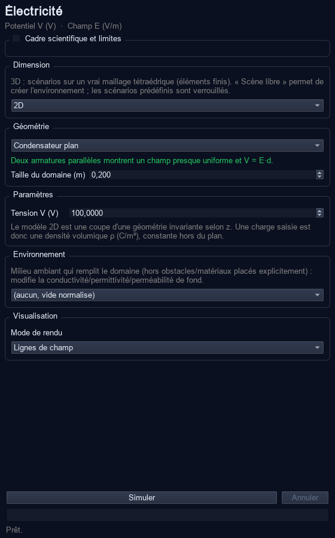

# FieldLab 2



FieldLab est un laboratoire multiphysique 2D/3D destiné aux cours de physique : électrostatique, magnétostatique et thermique. Le mode **Cours** fournit des scénarios prêts à simuler et des exports directement utilisables dans des diapositives ; le mode **Expert** expose le maillage, les solveurs et les conditions aux limites.

FieldLab is a 2D/3D multiphysics laboratory for physics teaching: electrostatics, magnetostatics and heat transfer. **Classroom mode** provides ready-to-run scenarios and slide-ready exports; **Expert mode** exposes meshes, solvers and boundary conditions. The interface can switch between French and English from **Langue / Language**.

## Télécharger / Download

- [Windows — FieldLab-Windows.zip](../../releases/latest/download/FieldLab-Windows.zip)
- [macOS — FieldLab-macOS.zip](../../releases/latest/download/FieldLab-macOS.zip)
- [Linux — FieldLab-Linux.tar.gz](../../releases/latest/download/FieldLab-Linux.tar.gz)

Décompressez l’archive, puis lancez `FieldLab` (`FieldLab.exe` sous Windows ou `FieldLab.app` sous macOS). Python n’est pas requis.

Extract the archive and launch `FieldLab` (`FieldLab.exe` on Windows or `FieldLab.app` on macOS). Python is not required.

### Avertissements des systèmes / OS warnings

Les binaires communautaires ne sont pas signés. Sous Windows, SmartScreen peut afficher « Windows a protégé votre ordinateur » : vérifiez que l’archive vient bien de cette page Releases, puis choisissez **Informations complémentaires → Exécuter quand même**. Sous macOS, faites un clic droit sur `FieldLab.app`, choisissez **Ouvrir**, puis confirmez ; ou autorisez l’application dans **Réglages Système → Confidentialité et sécurité**. Sous Linux, rendez le lanceur exécutable si nécessaire avec `chmod +x FieldLab/FieldLab`.

Community binaries are unsigned. On Windows, verify that the archive came from this Releases page, then use **More info → Run anyway** in SmartScreen. On macOS, right-click `FieldLab.app`, select **Open**, and confirm; alternatively allow it under **System Settings → Privacy & Security**. On Linux, run `chmod +x FieldLab/FieldLab` if needed.

## En cours / In the classroom

1. Choisissez un domaine et un scénario.
2. Ajustez les deux ou trois paramètres visibles, puis cliquez **Simuler**.
3. Posez jusqu’à cinq sondes, tracez un profil 1D ou lisez l’animation au facteur ×1 à ×1000.
4. Exportez une image 1080p, 1440p ou 4K, un profil CSV/PNG, ou une animation GIF/MP4 horodatée.

See the [Guide du professeur](docs/GUIDE_PROFESSEUR.md) for suggested activities and learning goals.

## Périmètre physique / Physical scope

- Les unités et les propriétés des matériaux sont en SI. Les durées thermiques sont de vraies secondes et dépendent de `κ/(ρcp)`.
- Le thermique fluide simule la **conduction pure**. La convection naturelle et l’écoulement ne sont pas résolus ; l’échauffement réel de l’eau peut donc être plus rapide.
- Le magnétisme 3D utilise Biot–Savart dans le vide. Les matériaux ferromagnétiques n’y modifient pas le champ et sont désactivés dans l’éditeur 3D magnétique.
- Un modèle 2D représente une géométrie invariante dans la direction hors plan : charges et courants y sont volumiques dans cette coupe extrudée, et non des objets ponctuels 3D.
- Les résultats restent des modèles numériques pédagogiques : vérifiez le maillage et les hypothèses avant tout usage d’ingénierie.

The SI material data and thermal time scales are physical. Fluid heat transfer is conduction-only; 3D magnetism is vacuum Biot–Savart; and 2D models assume out-of-plane invariance. FieldLab is a teaching simulator, not a certified engineering package.

## Pour les développeurs / For developers

Prérequis : [uv](https://docs.astral.sh/uv/) et Python 3.10 ou plus récent.

```bash
uv sync --extra dev
uv run fieldlab
uv run pytest
```

Créer le bundle local :

```bash
uv run pyinstaller --clean --noconfirm fieldlab.spec
```

Le résultat one-dir se trouve dans `dist/FieldLab`. Consultez [PACKAGING.md](docs/PACKAGING.md) pour les bibliothèques natives et [I18N.md](docs/I18N.md) pour le mécanisme FR/EN. Un tag `v2.0.0` déclenche automatiquement les trois builds et les joint à la GitHub Release.

## Licence / License

Ajoutez ici la licence choisie par le projet avant une diffusion publique. / Add the project’s chosen license here before public distribution.
